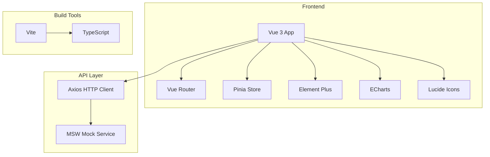

# 智能教学系统前端重构 - 技术架构文档

## 1. Architecture Design


## 2. Technology Description
- **Frontend**: Vue@3.5 + TypeScript@6.0 + Vite@8.0
- **UI Library**: Element Plus@2.5
- **Charts**: ECharts@5.5
- **Icons**: lucide-vue-next@0.300
- **State Management**: Pinia@2.1
- **Routing**: Vue Router@4.2
- **HTTP Client**: Axios@1.6
- **Mock Service**: MSW@2.0
- **CSS**: Scoped CSS + CSS Variables

## 3. Route Definitions
| Route | Purpose | Component |
|-------|---------|-----------|
| /login | 登录页面 | Login.vue |
| / | 首页重定向 | Redirect to /login or dashboard |
| /student/home | 学生首页 | student/Home.vue |
| /student/course/:id | 课程详情 | student/CourseDetail.vue |
| /student/video/:id | 视频学习 | student/VideoLearning.vue |
| /student/qa-history | 问答历史 | student/QaHistory.vue |
| /student/notes | 我的笔记 | student/Notes.vue |
| /student/settings | 设置 | student/Settings.vue |
| /teacher/home | 教师首页 | teacher/Home.vue |
| /teacher/knowledge | 知识图谱 | teacher/KnowledgeGraph.vue |
| /teacher/analytics | 数据分析 | teacher/Analytics.vue |
| /teacher/upload | 视频上传 | teacher/VideoUpload.vue |
| /admin/users | 用户管理 | admin/UserManagement.vue |
| /:pathMatch(.*)* | 404页面 | NotFound.vue |

## 4. Project Structure
```
frontend/
├── public/
│   ├── favicon.svg
│   ├── icons.svg
│   └── mockServiceWorker.js
├── src/
│   ├── assets/
│   │   └── styles/
│   │       ├── index.css
│   │       └── variables.css
│   ├── components/
│   │   ├── common/
│   │   └── layout/
│   ├── composables/
│   │   └── useTheme.ts
│   ├── mocks/
│   │   ├── browser.ts
│   │   ├── handlers/
│   │   └── data/
│   ├── router/
│   │   └── routes.ts
│   ├── stores/
│   ├── types/
│   │   └── api.ts
│   ├── utils/
│   ├── views/
│   │   ├── login/
│   │   ├── student/
│   │   ├── teacher/
│   │   ├── admin/
│   │   └── NotFound.vue
│   ├── App.vue
│   └── main.ts
├── .gitignore
├── index.html
├── package.json
├── tsconfig.json
├── vite.config.ts
└── README.md
```

## 5. Theme System
### 5.1 CSS Variables
```css
:root {
  --color-bg-primary: #1a1a2e;
  --color-bg-secondary: #16213e;
  --color-bg-tertiary: #0f3460;
  --color-bg-card: rgba(255, 255, 255, 0.05);
  --color-bg-hover: rgba(255, 255, 255, 0.1);
  
  --color-text-primary: #ffffff;
  --color-text-secondary: #a0aec0;
  --color-text-muted: #718096;
  
  --color-primary: #6366f1;
  --color-primary-dark: #4f46e5;
  --color-secondary: #3b82f6;
  --color-accent: #8b5cf6;
  
  --color-gradient-start: #6366f1;
  --color-gradient-end: #3b82f6;
  
  --color-border: rgba(255, 255, 255, 0.1);
  --color-divider: rgba(255, 255, 255, 0.08);
  
  --radius-sm: 6px;
  --radius-md: 8px;
  --radius-lg: 12px;
  --radius-xl: 16px;
  
  --shadow-sm: 0 1px 2px rgba(0, 0, 0, 0.3);
  --shadow-md: 0 4px 6px rgba(0, 0, 0, 0.4);
  --shadow-lg: 0 10px 15px rgba(0, 0, 0, 0.5);
  
  --transition-fast: 150ms;
  --transition-normal: 300ms;
  --transition-slow: 500ms;
}
```

### 5.2 useTheme Composable
```typescript
import { ref, watch, onMounted } from 'vue'

export function useTheme() {
  const isDark = ref(true)
  
  const toggleTheme = () => {
    isDark.value = !isDark.value
  }
  
  const applyTheme = () => {
    if (isDark.value) {
      document.documentElement.classList.add('dark')
    } else {
      document.documentElement.classList.remove('dark')
    }
  }
  
  onMounted(() => {
    applyTheme()
  })
  
  watch(isDark, () => {
    applyTheme()
  })
  
  return {
    isDark,
    toggleTheme
  }
}
```

## 6. Component Design Principles
1. **单一职责**: 每个组件专注于一个功能
2. **可复用性**: 提取通用组件到 `components/common/`
3. **类型安全**: 使用 TypeScript 严格类型检查
4. **样式隔离**: 使用 scoped CSS 避免样式污染
5. **性能优化**: 合理使用 computed 和 watch，避免不必要的重渲染

## 7. State Management
使用 Pinia 进行状态管理，主要 store 包括：
- `authStore`: 用户认证状态
- `userStore`: 用户信息
- `themeStore`: 主题状态
- `notificationStore`: 通知管理
