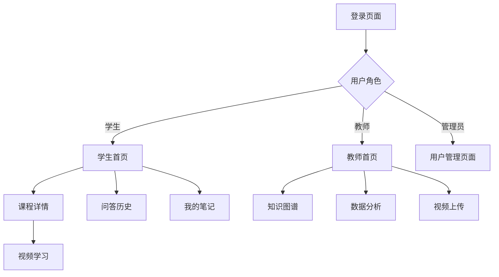

# 智能教学系统前端重构 - 产品需求文档

## 1. Product Overview
基于用户提供的设计图片风格，对智能教学系统的整个前端页面进行全面重构。采用深色主题设计，使用现代简洁的UI风格，包含圆角卡片、渐变按钮、清晰的视觉层次和适当的留白。

- 主要目的是提升用户体验，使界面更加美观、现代和易用，同时保持原有的功能完整性。
- 目标用户包括学生用户、教师用户和管理员用户。

## 2. Core Features

### 2.1 User Roles
| Role | Registration Method | Core Permissions |
|------|---------------------|------------------|
| 学生用户 | 账号登录 | 观看视频、提问、记笔记、查看课程 |
| 教师用户 | 账号登录 | 管理课程、上传视频、查看知识图谱、数据分析 |
| 管理员用户 | 账号登录 | 用户管理、系统设置 |

### 2.2 Feature Module
1. **登录页面**: 登录表单、品牌展示
2. **学生首页**: 功能卡片、课程推荐、快捷导航
3. **教师首页**: 侧边栏导航、功能概览
4. **课程详情页面**: 课程信息、课程目录、视频列表
5. **视频学习页面**: 视频播放器、知识点时间线、AI问答、笔记
6. **知识图谱页面**: 视频列表、知识片段管理、批量操作
7. **数据分析页面**: 热力图、KPI卡片、词云、学生排名
8. **视频上传页面**: 拖拽上传、表单填写、进度显示
9. **用户管理页面**: 用户列表、筛选、分页、操作按钮
10. **问答历史页面**: 问答记录列表、搜索、时间筛选
11. **笔记页面**: 笔记列表、笔记编辑、搜索筛选
12. **设置页面**: 用户设置、主题切换、偏好配置
13. **404页面**: 错误提示、导航链接

### 2.3 Page Details
| Page Name | Module Name | Feature description |
|-----------|-------------|---------------------|
| 登录页面 | 登录表单 | 用户名/密码输入、登录按钮、记住我选项 |
| 登录页面 | 品牌展示 | Logo、应用名称、简短描述 |
| 学生首页 | 功能卡片 | 课程学习、问答历史、我的笔记、设置等快捷入口 |
| 教师首页 | 侧边栏导航 | 知识图谱、数据分析、视频上传、用户管理等导航项 |
| 视频学习页面 | 视频播放器 | 播放控制、进度条、全屏、音量调节 |
| 视频学习页面 | AI问答面板 | 实时聊天、问题输入、回答展示 |
| 问答历史页面 | 问答记录列表 | 时间线展示、问题预览、详情展开 |
| 笔记页面 | 笔记列表 | 卡片式展示、时间戳、视频关联 |
| 404页面 | 错误提示 | 404图标、友好提示、返回首页按钮 |

## 3. Core Process
用户登录后根据角色进入相应的首页，学生可以浏览课程、观看视频、提问和记笔记；教师可以管理课程、上传视频、查看知识图谱和数据分析；管理员可以管理用户和系统设置。

## 4. User Interface Design
### 4.1 Design Style
- **主色调**: 深蓝色 (#1a1a2e) 作为背景色
- **辅助色**: 紫色 (#6366f1) 和蓝色 (#3b82f6) 渐变作为强调色
- **按钮风格**: 圆角 (8px-12px)、渐变背景、悬停效果
- **字体**: 使用现代无衬线字体，标题字体加粗，正文字体适中
- **布局风格**: 卡片式布局，清晰的模块分隔，适当的留白
- **图标风格**: 使用线性图标，颜色与主题保持一致

### 4.2 Page Design Overview
| Page Name | Module Name | UI Elements |
|-----------|-------------|-------------|
| 登录页面 | 整体布局 | 居中卡片、深色背景、渐变按钮、圆角输入框 |
| 学生首页 | 功能卡片 | 网格布局、卡片悬停效果、图标+文字组合 |
| 问答历史页面 | 列表布局 | 时间线样式、筛选标签、搜索框 |
| 笔记页面 | 笔记列表 | 卡片式布局、操作按钮、空状态提示 |
| 404页面 | 错误展示 | 大字号404、图标、渐变返回按钮 |

### 4.3 Responsiveness
- Desktop-first设计，移动端自适应
- 断点设置: xs (320px), sm (640px), md (768px), lg (1024px), xl (1280px)
- 触摸优化: 增大可点击区域，优化移动端交互体验

### 4.4 Animation
- 页面切换动画: 淡入淡出、滑动效果
- 卡片悬停: 轻微上浮、阴影加深
- 按钮交互: 点击缩放、颜色变化
- 加载状态: 骨架屏、旋转动画
